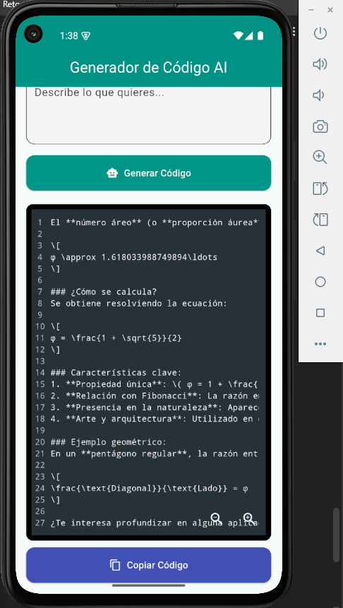

# 🤖 Generador de Código AI

**Generador de Código AI** es una aplicación Flutter que permite generar fragmentos de código automáticamente a partir de una descripción escrita por el usuario. Utiliza un servicio de inteligencia artificial (IA) que interpreta el texto y responde con código en lenguaje Dart. Ideal para programadores que desean asistencia rápida e inteligente al desarrollar.

---

## 🧠 Características

- ✅ Entrada de texto para describir el código deseado.
- 🤖 Conexión con una API de IA para generar código en tiempo real.
- 🎨 Visualización del código con resaltado de sintaxis.
- 📋 Opción para copiar el código generado al portapapeles.
- 🔄 Indicador de carga mientras se espera la respuesta.

---

## 🎥 Capturas de pantalla

### 📱 Pantalla Principal

| Entrada de texto |
|------------------|
|  |


---

## 🚀 Instalación y ejecución

### 1️⃣ Clona el repositorio

```bash
git clone https://github.com/Jhon98E/chat-con-IA-integrada.git
cd chat-con-IA-integrada
```

### 2️⃣ Instala las dependencias

```bash
flutter pub get
```

### 3️⃣ Configura la API
- Crea un archivo `.env` en la raíz del proyecto.
- Agrega tu clave de API de OpenAI en el archivo `.env`:

```env
AI_API_KEY=tu_clave_de_api
BASE_URL=https://api.openai.com/v1/chat/completions
```

### 4️⃣ Ejecuta la aplicación

```bash
flutter run
```